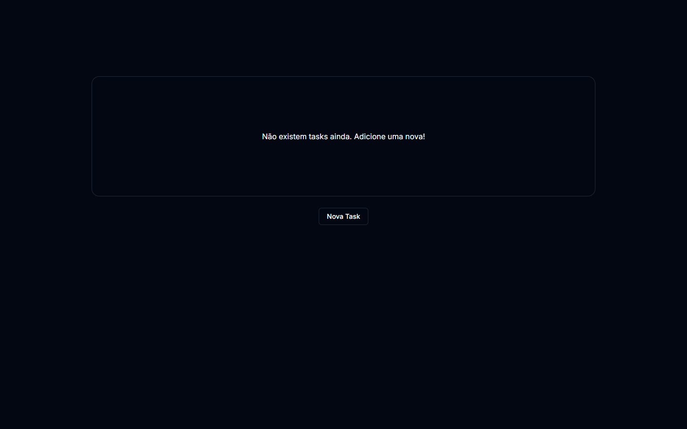
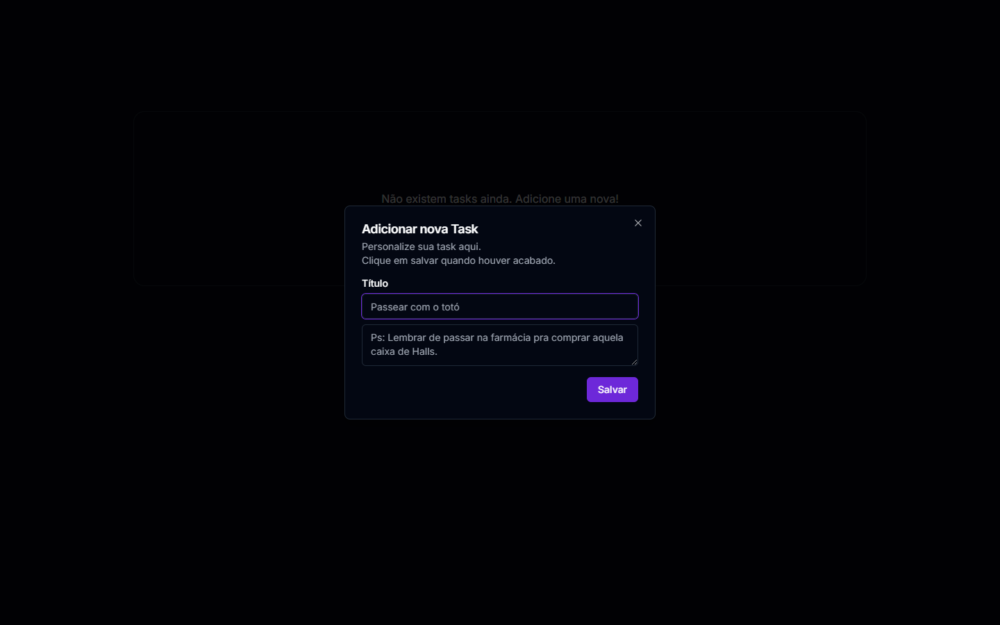
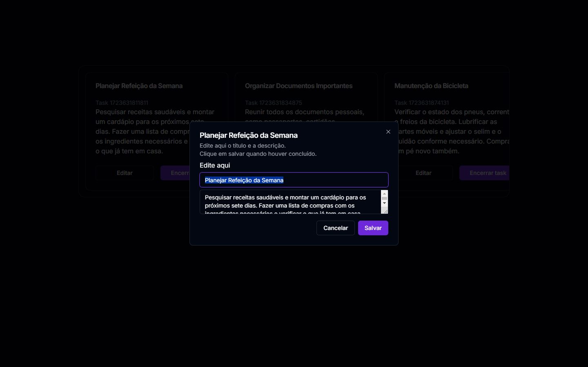
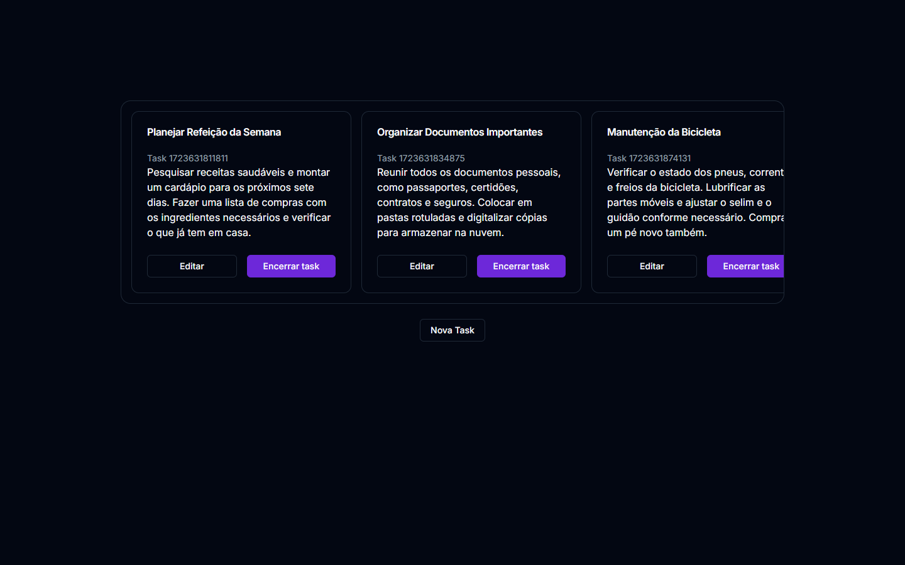

# nextjs-task-list

 <!-- Usando Tailwind como substituto, pois não há um ícone oficial do Shadcn-UI -->

Integrantes:

 - Jetro Kepler
 - Leandro Vital Pinho
 - Pedro Henrique Oliveira

 
Este foi o nosso primeiro projeto utilizando Next.js, e nosso foco era cumprir a descrião abaixo.

> O objetivo desse projeto é a criação de uma aplicação de task list, usando as tecnologias abordadas. A aplicação não vai consumir uma API, irá armazenar as informações em localStorage.  O sistema deve ser capaz de inserir uma listar, criar, atualizar e deletar uma tarefa. Para criar ou atualizar uma nova tarefa o usuário deve informar um nome e descrição.  A aplicação deve rodar na porta 7654.  Ps.: Vocês poderão dividir as tarefas entre vocês, da forma que preferirem. Criem um repositório no github e adicionem a descrição. (Deixem e repositório público)  Configurações: TailwindCSS, Shadcn-UI, ESLint, Prettier  Components: Task, um componente para representar na listagem uma tarefa criada pelo usuário; TaskAdd, um componente que apresenta um formulário em um "dialog component" com um formulário para cadastrar uma nova tarefa.

## Página principal sem tasks

## Componente TaskAdd 

## Editar Task

## Página principal com tasks
